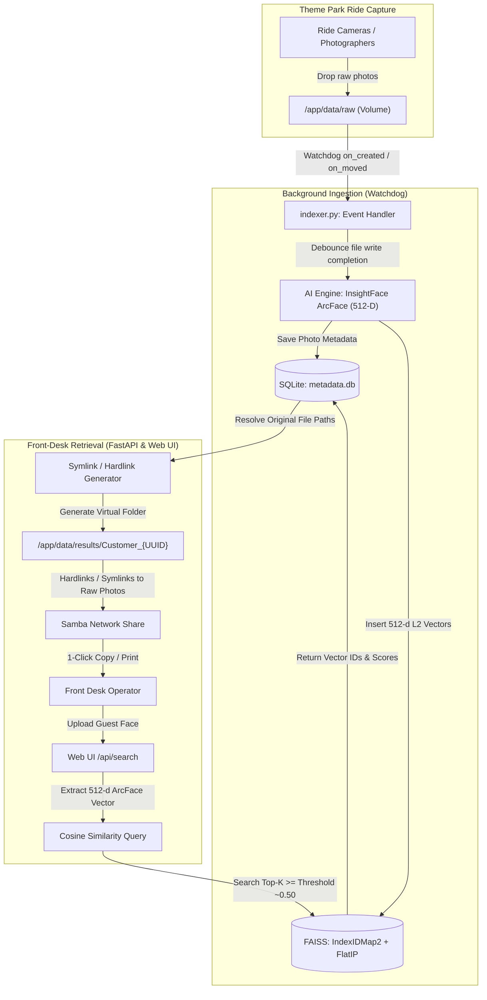

# Offline Face Recognition Photo Retrieval System for Theme Parks

A production-grade, containerized computer vision and vector retrieval system tailored for theme park ride photo kiosks and front-desk retrieval operations.

---

## 1. System Architecture & Workflow



---

## 2. Key Features

- **Mesin AI InsightFace / ArcFace (512-Dimensi ONNX Runtime)**: Standar industri biometrik modern paling mutakhir di dunia. Menghasilkan vektor fitur 512-dimensi yang sangat tahan terhadap kacamata hitam, masker tipis, bayangan pohon Maribaya, dan wajah dengan sudut kemiringan ekstrem hingga 60°.
- **Dual Engine Architecture**: Mendukung mesin utama **InsightFace (ArcFace 512-D)** serta mesin fallback **dlib (ResNet-34 128-D)** dengan auto-detection dan switching via Admin Dashboard.
- **Automated Real-time Ingestion**: Powered by `watchdog`, newly dropped photos in `/app/data/raw` (including nested ride subdirectories) are detected, debounced for write-completion, and indexed automatically in background threads.
- **Group Shot Multi-Face Extraction**: Roller-coaster photos with 4 to 12 people are fully parsed. Each face is individually located with bounding boxes and mapped to the parent photo in SQLite.
- **Fast Vector Similarity Search**: Leverages **FAISS** (`IndexIDMap2` with `IndexFlatIP`) performing L2-normalized cosine similarity queries in sub-millisecond time across 512-d hyperspace.
- **Zero-Copy Virtual Folders (Linux Symlinks / Hardlinks)**: Generates instantaneous customer folders containing native links pointing to raw photos without duplicating high-resolution photo storage.
- **Samba Network Drive Friendly**: Symlinks are generated with portable relative paths so Windows and macOS front-desk operators can open the network share (`\\samba-server\park-photos\results\Customer_{UUID}`) and copy photos directly into customer media or print queues.
- **Offline & Self-Contained**: No external cloud API calls, no third-party telemetry, fully operational in an isolated theme park local network (air-gapped environment). Model weights are cached locally in `./data/models/insightface`.

---

## 3. Directory Structure

```text
SistemPhoto/
├── Dockerfile                  # Ubuntu-based container with OpenCV/dlib build tools
├── docker-compose.yml          # Volume mounts for raw photos, results, and database
├── requirements.txt            # Python dependencies (FastAPI, FAISS, dlib, watchdog)
├── database.py                 # SQLite persistence & FAISS vector indexing engine
├── indexer.py                  # Watchdog folder monitor and background worker
├── main.py                     # FastAPI application, search API & symlink generator
├── test_system.py              # Architecture verification & unit test suite
├── .env.example                # Default environment variables
├── .dockerignore               # Container build exclusion rules
├── templates/
│   └── index.html              # High-contrast operational Web UI (Tailwind CSS)
└── data/
    ├── raw/                    # Dropped ride photos from camera systems
    ├── results/                # Virtual customer folders with Linux symlinks
    └── db/                     # SQLite database (metadata.db) & FAISS binary index
```

---

## 4. Quickstart Guide (Dockerized)

### Step 1: Clone or Copy Project
Ensure the project is in your target deployment directory (e.g., Ubuntu server or Docker host).

### Step 2: Configure Environment
Copy the environment template:
```bash
cp .env.example .env
```

Review default settings in `.env`:
- `RAW_DIR=/app/data/raw`
- `RESULTS_DIR=/app/data/results`
- `DB_DIR=/app/data/db`
- `DEFAULT_SIMILARITY_THRESHOLD=0.75`
- `SAMBA_NETWORK_PREFIX=\\samba-server\park-photos\results`

### Step 3: Launch with Docker Compose
```bash
docker compose up --build -d
```

### Step 4: Verify Deployment
Check running logs:
```bash
docker compose logs -f photo-retrieval
```

Visit the dashboard in your web browser:
```text
http://<server-ip>:8000
```

---

## 5. Front-Desk Operator Workflow

1. **Camera Ingestion**: Photo staff or ride automation drops photos into `./data/raw/` (e.g. `./data/raw/rollercoaster_1/IMG_4021.JPG`). Watchdog automatically logs:
   ```text
   Extracting faces from new photo: IMG_4021.JPG
   Registered IMG_4021.JPG: 4 faces indexed (photo_id: 12)
   ```
2. **Customer Arrival**: Guest approaches the retrieval kiosk. Front desk takes a quick photo of the guest's face or uploads their reference selfie.
3. **Trigger Search**: Click **"Scan Face & Locate Photos"**.
4. **Instant Match**: FAISS queries the vector database in ~40 milliseconds and returns matching photos with confidence percentages (e.g., `89% Match`).
5. **Copy Network Path**: The UI provides the generated Samba path:
   ```text
   \\samba-server\park-photos\results\Customer_4A9B2F10
   ```
   Operator clicks **"Copy Path"**, pastes into File Explorer, and accesses the raw photos immediately. Alternatively, click **"Download All as ZIP"** to download the package directly in the browser.

---

## 6. API Reference

### `POST /api/search`
Search for matching photos using a reference image.
- **Parameters (multipart/form-data)**:
  - `file`: Reference photo of the guest (JPEG, PNG, WebP)
  - `threshold`: Cosine similarity threshold (float `0.50` to `0.95`, default `0.75`)
  - `top_k`: Maximum photos to return (default `50`)
- **Response**:
  ```json
  {
    "success": true,
    "customer_id": "Customer_9F82A1B4",
    "result_dir": "/app/data/results/Customer_9F82A1B4",
    "samba_path": "\\\\samba-server\\park-photos\\results\\Customer_9F82A1B4",
    "match_count": 3,
    "query_time_ms": 38.4,
    "threshold": 0.75,
    "matches": [
      {
        "photo_id": 12,
        "file_name": "IMG_4021.JPG",
        "file_path": "/app/data/raw/coaster/IMG_4021.JPG",
        "max_score": 0.884,
        "preview_url": "/api/photos/12/preview",
        "num_faces": 4
      }
    ]
  }
  ```

### `GET /api/photos/{photo_id}/preview`
Lightweight JPEG thumbnail preview with green bounding boxes drawn around detected faces for visual operator verification.

### `GET /api/results/{customer_id}/download-zip`
Packages all matched original photos for a customer into a `.zip` archive on demand.

### `POST /api/reindex`
Triggers an immediate background directory scan of `/app/data/raw` to catch any files modified or added offline.

### `GET /api/stats`
Returns system statistics including total registered photos, indexed faces, and FAISS index state.

---

## 7. Samba Configuration Guide (Ubuntu Host)

To expose the results folder as a Windows/Mac network share:

1. Install Samba on the host:
   ```bash
   sudo apt-get install samba -y
   ```
2. Add the share configuration in `/etc/samba/smb.conf`:
   ```ini
   [park-photos]
   path = /path/to/SistemPhoto/data
   read only = no
   browsable = yes
   guest ok = yes
   follow symlinks = yes
   wide links = yes
   unix extensions = no
   ```
   > **Note on Symlinks**: Setting `follow symlinks = yes` and `wide links = yes` allows Samba clients to access symlinked files outside or across share boundaries.
3. Restart Samba:
   ```bash
   sudo systemctl restart smbd
   ```
